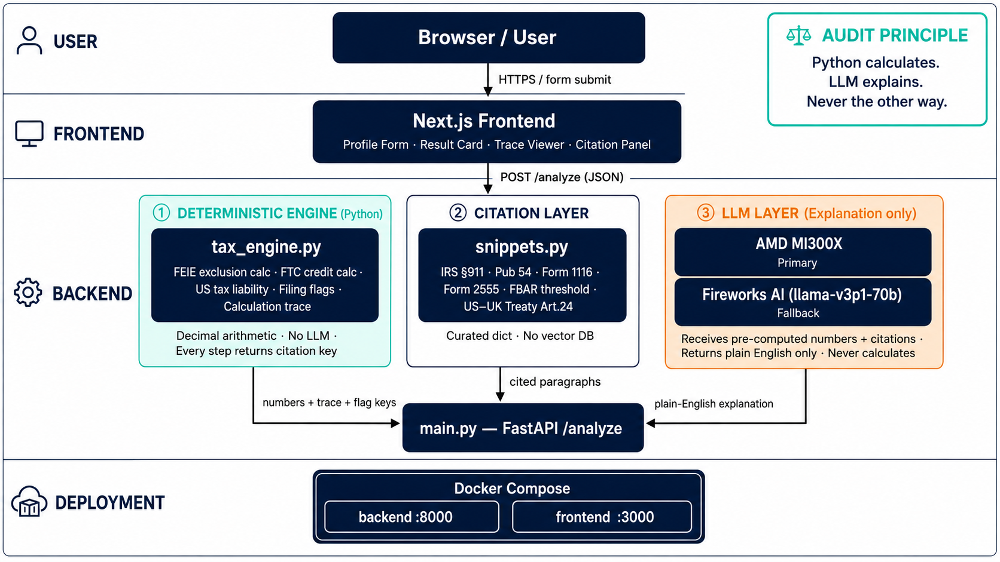
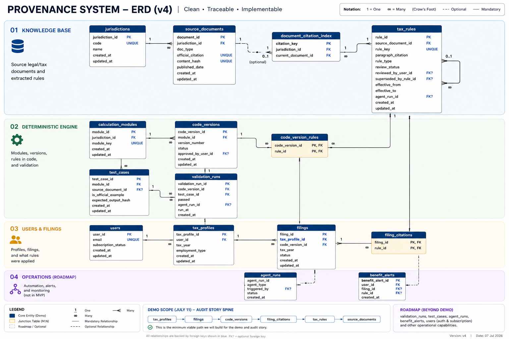

<div align="center">

# 🧾 Provenance

### AI reads the tax law. Python does the math. Every number traces back to the exact paragraph that produced it.

[](https://python.org)
[](https://fastapi.tiangolo.com)
[](https://nextjs.org)
[](https://www.amd.com)
[](https://docker.com)
[](LICENSE)

**Built for AMD Developer Hackathon: ACT II · Unicorn Track · July 2026**

[Demo](#quick-start) · [Architecture](#architecture) · [Data Model](docs/Erd.png) · [Full ERD Pack](docs/provenance_erd_v3_professional_pack.pdf)

</div>

---

## The Problem

~300,000 US citizens live and work in the UK. Every year they face a decision that can swing their US tax bill by **thousands of dollars**: claim the Foreign Earned Income Exclusion (FEIE) or the Foreign Tax Credit (FTC)?

Today's options:

| Option | Cost | Problem |
|---|---|---|
| TurboTax / H&R Block | $115–320/yr | Refuses complex expat cases |
| Human accountant | $500–1,500+/yr | Black box — "trust me" |
| Generic AI chatbot | Free | Hallucinates numbers, no audit trail |

**Nobody can answer "prove this number is right" with anything better than reputation. Provenance fixes that.**

---

## What We Built

A deterministic, auditable tax assistant for PAYE salaried US expats in the UK.

| You provide | Provenance returns |
|---|---|
| UK salary (£) | FEIE vs FTC comparison — exact figures |
| UK tax paid (£) | Recommended route + estimated US tax impact |
| Filing status | Filing flags: Form 1116, 2555, FBAR, Form 8938 |
| Days abroad | Cited IRS / HMRC / US–UK treaty paragraphs |
| Dependents | Full deterministic calculation trace |
| Foreign account balance | Plain-English AI explanation of every figure |

### What makes this different

| Other tools | Provenance |
|---|---|
| LLM calculates the numbers | **Python calculates. LLM only explains.** |
| "Here's your answer" | Every number traces to the exact law paragraph |
| Black box output | Full step-by-step calculation trace, always visible |
| Generic advice | Flags the exact forms you need to file |

> **Core architectural law:** The LLM never touches numbers. Deterministic Python functions run all tax math. The LLM receives pre-computed results + pre-fetched citations and returns plain English only. Break this rule and the audit claim dies.

---

## Architecture



The system has three strictly separated layers:

**1. Deterministic Engine** — Pure Python, `Decimal` arithmetic, zero LLM involvement. Computes FEIE exclusion, FTC credit, US tax liability, and filing flags. Every function returns its result alongside the citation key that justifies it.

**2. Citation Layer** — Curated IRS/HMRC/treaty snippets retrieved by citation key. No vector DB, no embeddings — hand-picked for reliability over breadth.

**3. Explanation Layer** — AMD MI300X receives pre-computed numbers + pre-fetched citations. Returns plain-English explanation only. Fireworks AI is the fallback if AMD is unavailable.

---

## Data Model



Four domain bands: **Knowledge Base** · **Deterministic Engine** · **Users & Filings** · **Operations (Roadmap)**

The demo audit story spine:
```
tax_profiles → filings → code_versions → filing_citations → tax_rules → source_documents
```
Every output number traces through this chain to the source paragraph.

→ [Full modular ERD + relationship catalogue](docs/provenance_erd_v3_professional_pack.pdf)

---

## Design Decisions

| Decision | What we chose | Why |
|---|---|---|
| LLM role | Explanation only | Hallucinated tax numbers are a liability, not a feature |
| RAG approach | Curated snippets, not bulk ingestion | 6 reliable citations beat 600 uncertain ones for a demo |
| FX rate | Fixed GBP/USD 1.27 constant | Live FX adds failure points with zero demo value |
| Database | None in MVP | Filing persistence is roadmap; the audit trail is in the trace |
| Auth | None in MVP | Single-session demo; users table is roadmap |
| Tax year | 2024 constants hardcoded | Parameterising years adds complexity with no demo upside |

---

## Demo Scope (July 11)

**In scope:**

- PAYE UK salary earner only
- Single tax year (2024 constants)
- FTC vs FEIE election comparison
- Filing flags: Form 1116, Form 2555, FBAR, Form 8938
- Plain-English LLM explanation with cited paragraphs
- Full calculation trace visible in UI

**Out of scope — not built, not promised:**

- Self-employment / freelance income
- Multi-year carryforward
- PFIC / Form 8621
- Actually filing the forms
- LLM chat / Q&A loop
- Live FX rates

---

## Tech Stack

| Layer | Technology |
|---|---|
| Language | Python 3.12 |
| API | FastAPI + Pydantic v2 |
| Calculation | Pure Python · `Decimal` arithmetic · no floats |
| Citation RAG | Curated dict — IRS / HMRC / US–UK treaty snippets |
| LLM (primary) | AMD MI300X via AMD Developer Cloud |
| LLM (fallback) | Fireworks AI — `accounts/fireworks/models/gpt-oss-120b` |
| Frontend | Next.js 14 + Tailwind CSS |
| Deployment | Docker Compose |

---

## Quick Start

```bash
git clone https://github.com/V-Vekaria/AMD-Hackathon
cd AMD-Hackathon
cp .env.example .env        # add your AMD + Fireworks keys (optional — degrades gracefully)
docker compose up --build
```

Frontend → http://localhost:3000  
API docs → http://localhost:8000/docs

**Without Docker:**
```bash
# Backend
cd backend && pip install -r requirements.txt
uvicorn main:app --reload

# Frontend
cd frontend && npm install && npm run dev
```

**Test the API directly:**
```bash
curl -X POST http://localhost:8000/analyze \
  -H "Content-Type: application/json" \
  -d '{
    "uk_salary": 85000,
    "uk_tax_paid": 24000,
    "filing_status": "single",
    "days_abroad": 340,
    "dependents": 0,
    "foreign_account_balance_over_10k": false
  }'
```

---

## Repo Structure

```
provenance/
├── backend/
│   ├── main.py            # FastAPI — /analyze endpoint
│   ├── models.py          # Pydantic schemas
│   ├── tax_engine.py      # deterministic FEIE/FTC calculator
│   ├── snippets.py        # curated IRS/HMRC/treaty citations
│   ├── llm/
│   │   └── client.py      # AMD MI300X + Fireworks fallback
│   └── requirements.txt
├── frontend/              # Next.js — form + result card + trace viewer
├── docs/
│   ├── Architecture.png   # system architecture diagram
│   ├── Erd.png            # data model (single image)
│   └── provenance_erd_v3_professional_pack.pdf
├── docker-compose.yml
├── Dockerfile.backend
├── Dockerfile.frontend
├── .env.example
└── README.md
```

---

## Environment Variables

```bash
# .env.example — all keys optional; with none set the API returns the
# deterministic trace summary instead of an LLM explanation
AMD_API_KEY=your_amd_key_here
AMD_MODEL_ENDPOINT=https://your-amd-endpoint/v1/chat/completions   # OpenAI-compatible
FIREWORKS_API_KEY=your_fireworks_key_here
GBP_USD_RATE=1.27
```

---

## Market

| | |
|---|---|
| US citizens in the UK | ~200–300K |
| US citizens abroad (total addressable) | ~9M |
| Current cheapest option | $115/yr — and it refuses complex cases |
| Current human option | $500–1,500+/yr |

UK is the wedge market. The policy-to-code architecture extends to any dual-filing jurisdiction pair — Canada, Australia, Germany — with zero changes to the engine core.

---

## Roadmap

- [ ] Persistent filing history (tax_profiles + filings tables)
- [ ] User auth + subscription
- [ ] Policy-change alerts mapped to your specific filing
- [ ] PFIC detection + Form 8621
- [ ] Brokerage CSV import
- [ ] Multi-year carryforward tracking
- [ ] What-if simulator (FTC vs FEIE with salary scenarios)
- [ ] Jurisdiction #2 via swappable module pack — same engine, new rules file
- [ ] E-file integrations (IRS MeF, HMRC-recognised software)

---

## Team

· Gael · [Vishnu Vekaria](https://github.com/V-Vekaria)

---

*AMD Developer Hackathon: ACT II · Unicorn Track · lablab.ai × AMD × NativelyAI · July 2026*
